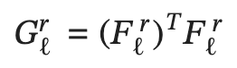

# DCGAN-and-Style-Transfer

## GAN and DCGAN

Developed both a novel Generative Adversarial Network and Deepy Convolutional Generative Adversarial Network.

Both GANS utilize a adversarial binary cross entropy loss. Described generally by: 

  Explanation:
  
    * The loss shows that the generator attempts to minimize and the discriminator attempts to maximize the value/loss
    function V. This is a minimax algorithm.
    * z is random noise, that the generator uses to 'mold' into a image that will 'fool' the discriminator.
    * The loss can be interpreted as the expectation that x (a real image from the dataset) is from the true distribution
    of data.
    * Since the discriminator attempts to maximize this, it will want to accurately predict which images are from the real 
    distribution and which are not. 
    * The second part of the loss is the expectation that the discriminator can correctly tell that the generated images 
    are fake. 
    * Since the generator, wants to minimize the loss it will attempt to make the discrimintor predict that images are 
    from the true distribution and not the random noise distribution. 

I simplified this into two losses which we can minimize over both, just to make model converging easier. Additionally, I applied a sigmoid function to the outputs in order to keep calculations numerically stable (0 < loss < 1). 

The losses are described as:

and 

Code wise, I used BCE (binary cross entropy) to compute the loss for the discriminator, which used the real logits (discriminator output on real images) and fake logits (discriminator output on generated images).

For generator loss, I used the BCE between the fake logits (again discriminator output on generated images) and just ones (since we want these to be discriminated as real images). 

To better understand the training process I have a graph pictured below, this graph makes training seem simple. Which is true, and I utilized the same training and loss calculations for both DCGAN and GAN.

Note: The only difference between GAN and DCGAN is the use of convolutional layers in DCGAN instead of linear layers in GAN. This is a small, but very important difference as highlighted by the results below. The convolutional layers allow for better spatial understanding, and allow the generator to understand the underlying structure of a number. A convolutional layer would understand the general structure of a 3, while a linear layer would not necessarily.

### Results DCGAN and GAN:

**GAN:**

**DCGAN:**

Results Evaluation:
  * As seen above, the DCGAN images tend to be more clear and lack the spotiness around the edges. They are sharper. This is a result of the convolutional spatial understanding.
  * Furthermore, the DCGAN has some 'hallucinations' that may be fixable with some regularization such as L2 or L1, but would add some blurriness.
  * Adding reg such as above, may not be a good idea, but could be decent if you clip some grey colors to black or white based on a threshold. Just something to try.

## Style Transfer

I developed an algorithm to do style transfer. Style transfer is where you take a image (say a monet painting) and another image (say a cityscape) and apply the style of one of the images to the other image. In this example, it would produce a city scape painted by Monet. The nice thing is that it works both ways, you can take a Monet painting and remove the Monet style, which would give the landscape Monet potrayed. 

Sounds cool, but how was it done?

In my case, I used a pretrained model and then fine tuned it to complete this task. The model I used was SqueezeNet which was trained on ImageNet (a very large set of images). To do this I used a curated loss function comprised of three tasks: content loss + style loss + total variation loss.

The content loss is defined as:

The content loss is meant to measure the differences of features (fancy term for outputs) at each layer of the generated image compares to the source image. The idea is that the generated image should match the source image roughly in structure. It should remain relatively the same. 

This function takes the sum of the squared difference between both feature maps at each point in the map. Essentially just a L2 loss over each feature map. Then multiplies by a weight (set by the user) w_c.

Next the style loss is defined as (below) for each layer:

We calculate the Gram Matrix of the source and content images. It gives G and A (respectively) in this equation we get it by doing:

The style loss is meant to measure how much the generated image (features at each layer) matches the style of the source image (at each layer). It does this by calculating the Gram Matrix for the features of both the source and generated image. The Gram Matrix approximates the covariance of the features. This allows it to emulate the texture or pattern in the image, by being able to tell that a certain pattern tends to happen in the image. Then for each layer the difference of Gram Matrices is multiplied by a style loss weight similar to the content loss. Then it is finally summed accross each layer.

Finally,
The total variation loss is defined as:

The total variation is a form of regularization. In computer vision, often regularization is used to encourage the model to smooth the images (and sometimes prevents hallucinations). Note that x is the generated image. This is done with a L2 loss, where I take the squared difference between each pixel value that is above, below, or horizontal to a pixel value. This function looks scary due to the three summations, but is pretty simple. The first summation is over the channel dimension (3 channels for r,g, and b), the next is over the height dimension (32x16image has height 32), and the final is over the width dimension (32x16 image has width 16). Then the loss is multiplied by a regularization strength. 

With these three losses combined, we can selectively choose how much source style we want, how much source content we want, and how much variation we want in pixel values. 

In this example, I used content weight: 5e-2, style weights: 20000, 500, 12, 1 (for each layer), and total variation weight: 5e-2.
  The style weights were chosen such that the early information in the convolutions is prioritized (to keep initial structure similar). 

These are good examples of hyperparameters in training.

**Now for some examples:**

**Results:**

**Feature Inversion:**
A cool trick you can do is set the style loss weight to zero and have the source image set to random noise. If you do this you can somewhat regenerate the original (content image).

_Example:_

**Spatial Style Loss**
I also implemented a method to localize what styles we want to go where. The idea is that take we have two images and we want the style of the sky in one image to be the sky in the source image and we want the style of the house in one image to be the style of the house in the source image we can do that. This is done by localizing where we apply the styles.

I achieved this with a modified version of the losses above. We do this by modifying the gram matrix (recall this was used to apply texture/style for style loss).

We introduce region channels to single out the region we want a specific style to apply to. This modifies the Gram Matrix to:

Using out region filter:

The filter T is essentially zeros and ones, where there are ones in the region we want to apply style to. Now using this changed Gram Matrix that only applies the 'pattern' to the regions. We modify the style loss to:

There is a small change, where we sum over each region (R). This just ensures that each filter is summed with the rest of the filters, so they combine into one loss. 

With these modifications we can do essentially the same thing as earlier, but with more images. Note that for each image you add to apply a local style to a source image, R becomes larger (R is the number of these images).

**_Example:_**

**Given:**

**I get:**

Note: I glossed over how we get the regions. This can be done many ways, but a good way to do this is Mask RCNN. It semantically segments the image into classes (take the sky and the house). Read more here: [Mask RCNN Paper](https://arxiv.org/abs/1703.06870)

## Sources:

- [GAN Paper](https://arxiv.org/abs/1406.2661)

- [DCGAN Paper](https://arxiv.org/abs/1511.06434)

- [InfoGAN Paper](https://arxiv.org/pdf/1606.03657.pdf): used for the generator model architecture in DCGAN.

- [Style Transfer Paper](http://www.cv-foundation.org/openaccess/content_cvpr_2016/papers/Gatys_Image_Style_Transfer_CVPR_2016_paper.pdf)

- [Feature Inversion Paper](https://arxiv.org/abs/1412.0035)

- [Localized Style Loss Paper](https://openaccess.thecvf.com/content_cvpr_2017/papers/Gatys_Controlling_Perceptual_Factors_CVPR_2017_paper.pdf)

